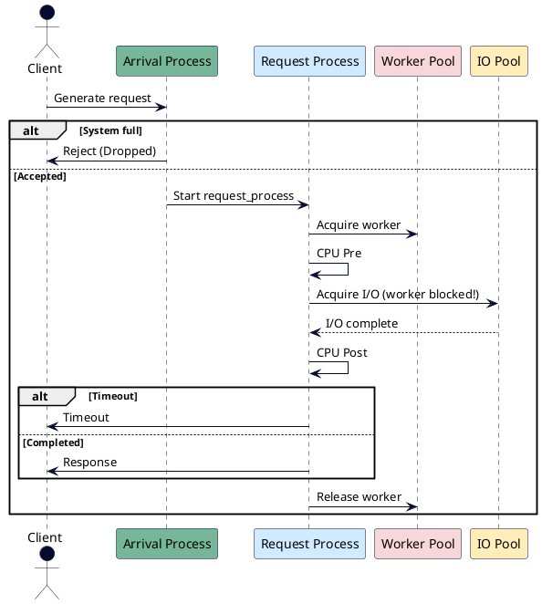
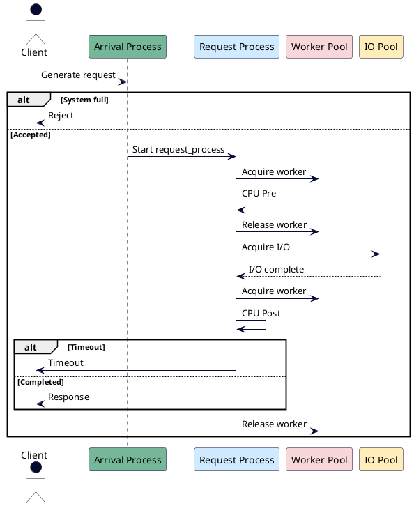

# simweb – Sync vs Async Webserver Simulation

This project is a **discrete-event simulation framework** (built on [SimPy](https://simpy.readthedocs.io/)) for studying the performance of **synchronous (thread-per-request)** vs **asynchronous (event loop)** server models.

It provides a sandbox to explore when **async really helps** and when it does not, using the **four golden signals** from [Google SRE best practices](https://sre.google/sre-book/monitoring-distributed-systems/):

- **Throughput** (requests per second)
- **Latency** (p95 / p99)
- **Success Rate** (% of requests completed without drop/timeout)
- **Saturation** (worker utilization)

Results can be visualized as time-series dashboards and aggregated reports.

---

## 🔍 Motivation

Real benchmarking of web systems is **hard**:
- Real workloads are often **too complex to replicate**.
- Mock workloads are **too simplistic**.
- Iteration is slow (10min benchmark × 6 configs = 1h).
- Results are **hard to reproduce** due to hardware, kernel, or network differences.

Simulation offers:
- **Fast iteration** (seconds instead of hours).
- **Controlled knobs** (CPU %, IO wait, arrival rate, timeouts, limits).
- **Fair sync vs async comparisons** in identical conditions.
- **Educational value** — explains why async shines in IO-bound cases but degrades for CPU-bound workloads.

---

## ⚙️ Models

We model a **web worker process**:

- **Sync mode**  
  - Multiple threads (best practice: ~2–4 per core).  
  - Threads block during IO.  
  - Worker pool capacity = `thread_count`.

- **Async mode**  
  - Single-threaded event loop.  
  - CPU phases block the loop, but IO waits release it.  
  - Worker pool capacity = `1`.

### Simulation pipeline

1. **Clients** generate requests according to arrival distributions:
   - Poisson (default)
   - Bursty arrivals (optional)
2. **Admission gate** applies `queue_limit` (drop if exceeded).
3. **Worker pool** executes the service logic:
   - CPU work (pre + post IO split)
   - IO wait
4. **Timeouts** cut off long-running requests.
5. **Request records** store:
   - arrival / finish time
   - latency
   - status (`completed`, `dropped`, `timeout`)
   - cpu_time used

---

## 📊 Metrics

Two complementary aggregation methods:

- **Group metrics**  
  Aggregate by experiment parameters (mode, rate, cpu%) across replications.
  - Throughput: mean completed / wall time
  - Success rate: mean %
  - Saturation: mean utilization
  - Latency: pooled p95, p99 from all requests

- **Time metrics**  
  Bin requests by finish time (default 1s bins) to see golden signals over time.  
  Useful for transient analysis (e.g., queues filling, saturation waves).

---

## 📈 Example Results

- **Async wins** when requests are mostly IO.  
- **Sync wins** or is at least more predictable when CPU dominates.  
- Increasing arrival rate → throughput scales until **saturation**, then:
  - Latency spikes near **timeout**
  - Success rate collapses
  - Throughput plateaus or drops

---

## 📦 Usage

### Run experiments

```bash
python experiments/experiment_cpu_rate.py
````

Generates:

* `report_cpu_rate.csv` – raw results
* `report_cpu_rate.html` – interactive plots:

    * Heatmaps (CPU% × Rate)
    * Line charts (throughput vs rate, per CPU%)

### Run dashboard (time series)

```bash
python experiments/dashboard.py
```

Generates:

* `dashboard.html` – time-series charts of golden metrics.

---

## 🧪 Assumptions

* 1 process per core.
* Sync: 2–4 threads per core (fixed `thread_count`).
* Async: 1 event-loop thread per process.
* Request CPU is split randomly between pre-IO and post-IO phases.
* IO and CPU service times follow **exponential** or **log-normal** distributions.
* Arrivals are Poisson (default), but bursty arrivals supported.

---

## ⚠️ Limitations

* Simulation is **not a real benchmark**; results are illustrative.
* Hardware effects (cache, syscalls, kernel scheduler) are ignored.
* Only models *one process*; no distributed scaling yet.
* Simplified service model (CPU+IO only, no pipelining/middleware).
* Async model assumes perfect IO multiplexing, no context-switch overhead.
* Queueing is **FIFO only** (no prioritization, no fairness).

---

## 🖼️ Architecture Diagram

### Sync



### Async



---

## 🚀 Roadmap

* [ ] Add visualization of **worker occupancy vs CPU busy**.
* [ ] Validate **resource cleanup** on timeout via stress tests.
* [ ] Explore **priority queues**.
* [ ] Extend to **multi-process scaling**.

---

## 🤝 Contributing

Contributions welcome! Ideas:

* More arrival distributions
* More service time models
* Better visualization dashboards
* Real workload traces as input

---

## 📜 License

Apache 2.0
